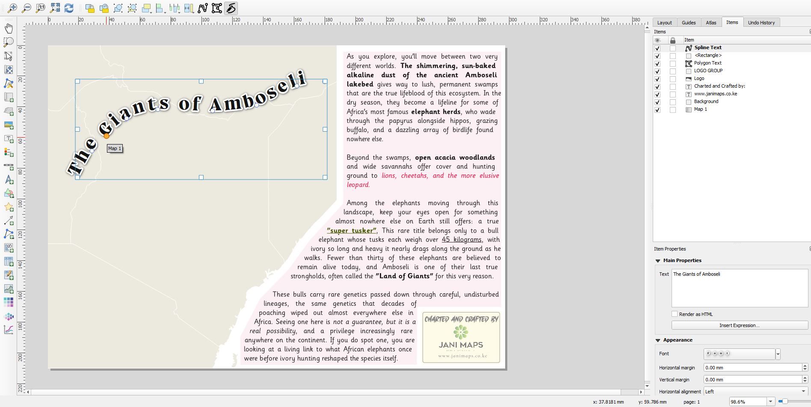

# Curved & Polygon Text (For Layouts)

Curved & Polygon Text adds editable Curved Spline Text and Polygon Text items
to the QGIS Layout Designer.

The plugin requires **QGIS 3.44 or later**.

## Installation

1. Open QGIS.
2. Go to **Plugins > Manage and Install Plugins > All**.
3. Search **Curved & Polygon Text (For Layouts)** and choose **Install Plugin**.
4. Ensure **Curved & Polygon Text (For Layouts)** is enabled in the Installed
   plugins list.
5. Open or create a Print Layout.

The lower Layout Designer toolbar will contain three plugin actions:

- **Add Curved Spline Text**
- **Add Polygon Shaped Text Box**
- **Edit Curve / Polygon Nodes**

## Creating items

### Curved Spline Text

1. Select **Add Curved Spline Text**.
2. Click at least two points to define the text path.
3. Finish by double-clicking, right-clicking, or pressing **Enter**.
4. Press **Escape** to cancel an unfinished item.

### Polygon Text

1. Select **Add Polygon Shaped Text Box**.
2. Click at least three points to define the polygon.
3. Finish by double-clicking, right-clicking, or pressing **Enter**.
4. Press **Escape** to cancel an unfinished item.

After creation, the plugin returns to QGIS's normal Select/Move Item tool.
Select an item to edit its text and formatting in Item Properties. The Frame
group controls whether the spline or polygon outline is drawn, together with
its colour and width.

Plain text, native **Allow HTML formatting**, plugin **Render as HTML**, and
QGIS expressions written as `[% expression %]` are supported. The two HTML
modes are separate: Allow HTML formatting uses QGIS text formatting and font
effects, while Render as HTML uses the richer HTML renderer.

## Editing nodes and Bezier curves

1. Select a Curved Spline Text or Polygon Text item.
2. Select **Edit Curve / Polygon Nodes**.
3. Drag an anchor node to move it.
4. Drag a square Bezier handle to reshape a curved segment.
5. Double-click the curve or polygon edge to add an anchor while preserving
   the existing curve shape.
6. Right-click an anchor to choose **Corner**, **Smooth**, **Symmetric**,
   **Reset Handles**, or **Delete Node**.
7. Right-click close to a segment to convert that segment between straight
   and cubic Bezier geometry.

While dragging a handle, hold **Ctrl** (or Command/Meta on macOS, with Alt as
an alternative) to move that handle independently. Hold **Shift** to constrain
the handle direction to 15-degree increments.

A spline retains at least two anchors and a polygon retains at least three.
Bezier handles and handle arms are editing aids and are not included in exports.

When an item is not selected, spline text is selected by clicking near its
curve and polygon text is selected by clicking inside its polygon. After
selection, the complete rectangular QGIS extent and its standard move, resize,
and rotation controls are available.

## Status

Version **1.0.2** adds editable cubic Bezier geometry to both Spline Text and
Polygon Text while retaining compatibility with projects created by v1.0.0 and
v1.0.1. Both item types support creation, formatting, node/control-handle
editing, layout saving and reopening, recovery data, zoom-safe preview
rendering, and layout export. The supported QGIS range is **3.44 or later**,
including QGIS 4.x.

## Known limitations

- Spline text places glyphs individually along the curve, so pair kerning can
  differ slightly from straight native label text.
- The initial selectable band for a spline follows the base text height. Large
  buffers or shadows do not enlarge that selectable area.
- Polygon wrapping can flow a visual row through multiple disjoint interior
  spans of a concave shape, proceeding left-to-right before advancing to the
  next row. Self-intersecting polygons remain subject to even-odd fill rules.
- Polygon inner padding is an inward scale toward the polygon centroid rather
  than a full geometric offset, so highly concave polygons may have uneven
  apparent padding.
- Very complex HTML, extreme font effects, or unusually dense node geometry
  may take longer to redraw than plain text.
